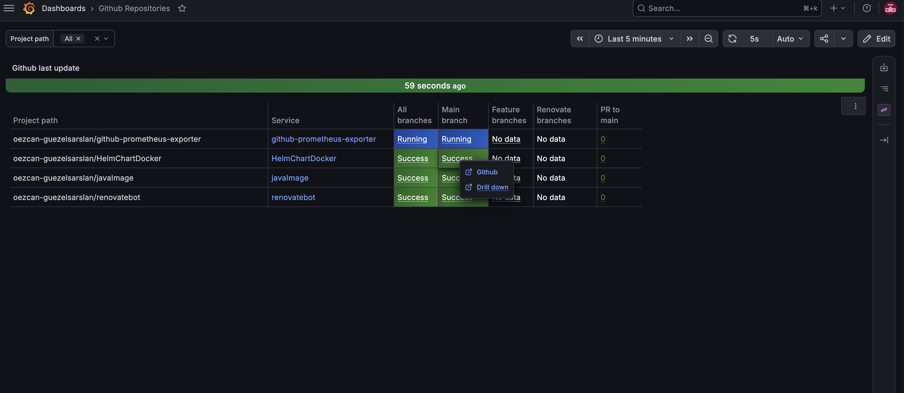
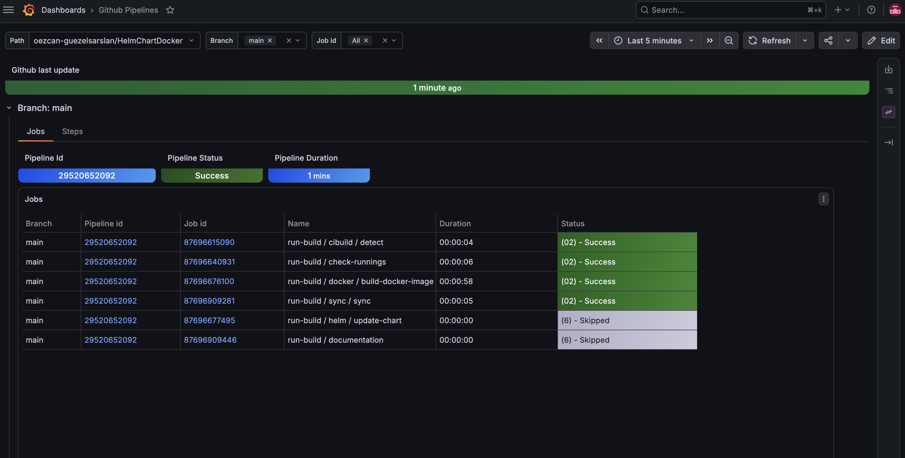
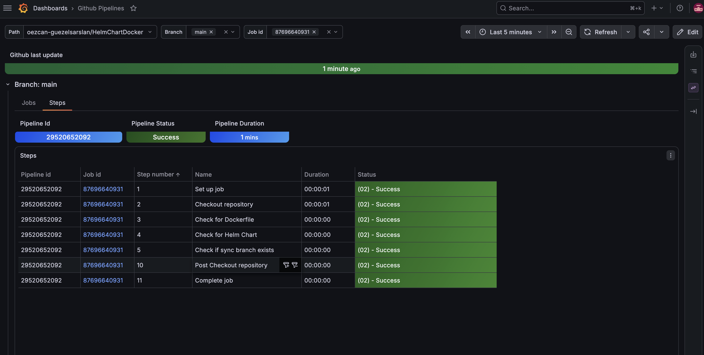

# github-prometheus-exporter

Steps to startup
1. configure PAT TOKEN in .env file
2. Startup with docker-compose up -d
3. Login in grafana http://localhost:3000 with username and password configured in .env
4. Go to Dashboard http://localhost:3000/d/bf009823-6765-4248-a740-317b3a69225d

# Screenshots

